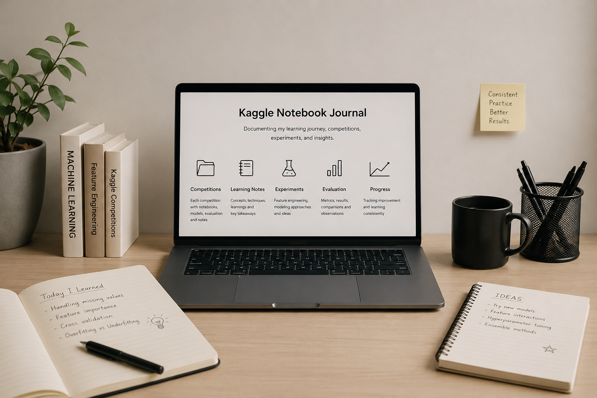

# Kaggle Notebook Journal

A personal repository documenting my Kaggle learning journey, competition progress, experiments, and machine learning workflow step by step.

## About This Repository

This repository is used to track:
- Kaggle competition notebooks
- Learning notes and new concepts
- EDA and preprocessing workflows
- Feature engineering experiments
- Model training and evaluation
- Submission history and leaderboard progress
- Mistakes, improvements, and lessons learned

The goal is to build a structured archive of my practical ML and data science journey through continuous experimentation and competition practice.

---

## Repository Structure

```
kaggle-notebook-journal/
│
├── competitions/
│   │
│   ├── titanic/
│   │   ├── notebooks/
│   │   ├── learning-notes/
│   │   ├── models/
│   │   ├── evaluation/
│   │   ├── submissions/
│   │   ├── datasets/
│   │   └── README.md
│   │
│   ├── house-prices/
│   │   ├── notebooks/
│   │   ├── learning-notes/
│   │   ├── models/
│   │   ├── evaluation/
│   │   ├── submissions/
│   │   ├── datasets/
│   │   └── README.md
│
├── global-learning-notes/
├── reusable-code/
├── resources/
└── README.md
````

---

## What You’ll Find Here

* Competition-specific notebooks (`.ipynb`)
* Learning notes from each competition
* Experiment tracking and observations
* Model evaluation and comparison
* Feature engineering ideas
* Submission improvements and iteration history
* Reusable ML workflows and utilities

---


## Tools & Technologies

| Category | Tools / Technologies | Purpose |
|---|---|---|
| Programming Language | Python | Core language used for data analysis, machine learning, experimentation, and Kaggle workflows |
| Data Manipulation | Pandas, NumPy | Data cleaning, preprocessing, transformation, numerical operations, and feature preparation |
| Data Visualization | Matplotlib, Seaborn | Exploratory Data Analysis (EDA), statistical visualization, trend analysis, and model interpretation |
| Machine Learning | Scikit-learn | Classical machine learning models, preprocessing pipelines, validation, and evaluation |
| Deep Learning | PyTorch | Neural network development, deep learning experimentation, and custom model training |
| Gradient Boosting Models | XGBoost, LightGBM | High-performance boosting algorithms commonly used in Kaggle competitions |
| Development Environment | Jupyter Notebook | Interactive experimentation, notebook-based workflows, visualization, and documentation |
| Competition Platform | Kaggle | Competition participation, notebook sharing, dataset exploration, and benchmarking |
| Experiment Tracking | Evaluation Metrics, Submission Logs | Tracking model performance, leaderboard scores, iteration history, and improvements |
| Learning & Research | Competition Notes, Learning Journals | Documenting concepts learned, mistakes, feature engineering ideas, and workflow improvements |
| Feature Engineering | Custom Pipelines, Encoding Techniques | Creating meaningful features and improving model performance |
| Model Evaluation | Cross Validation, Metrics Analysis | Measuring model quality, reducing overfitting, and validating experiments |
| Version Control | Git, GitHub | Organizing projects, tracking progress, and maintaining repository structure |
| Future Learning Areas | RAG, LLMs, Hugging Face, Spark, Power BI | Expanding into AI engineering, large language models, big data, and analytics workflows |

---

## Goal

To consistently learn, experiment, and document every stage of the machine learning process while improving through real Kaggle competitions and hands-on practice.

```
```
